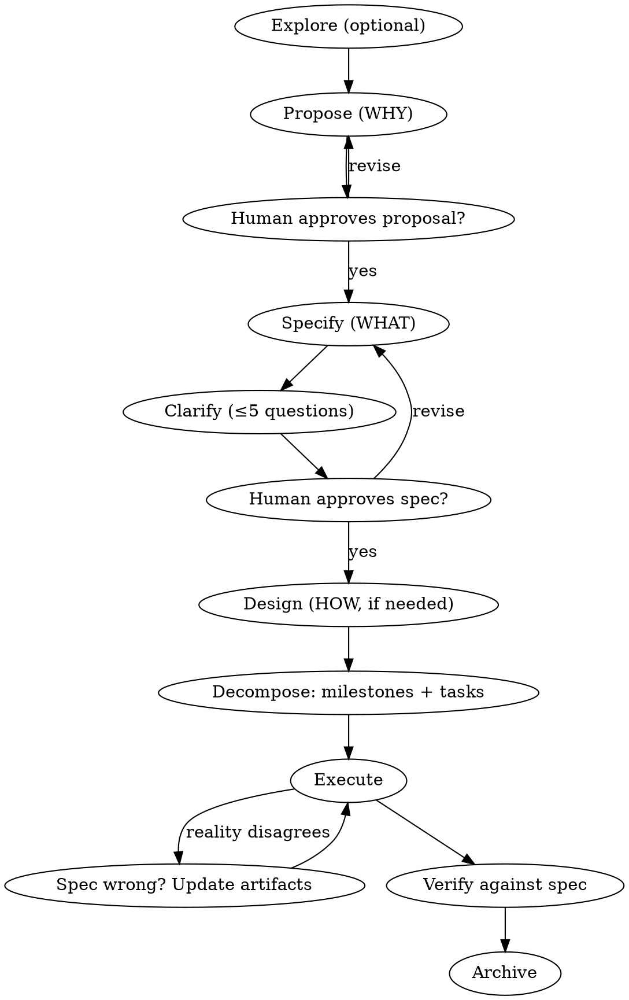

# Spec-Driven Workflow

## Overview

Structured work in any domain fails the same way: execution starts before intent is agreed, requirements live only in someone's head, and "done" has no definition. This skill inverts that. **The spec is the source of truth; execution serves the spec.**

Every change moves through a chain of small artifacts, each answering one question:

| Artifact | Question | Skip when |
|----------|----------|-----------|
| Proposal doc | **WHY** are we doing this? | Never — always write it (can be 5 lines) |
| Spec doc | **WHAT** must be true when we're done? | Never — always write it |
| Design doc | **HOW** will we approach it? | Simple changes with one obvious approach |
| Milestones + tasks (Backlog.md) | **In what order**, by whom, verified how? | Never — always create them |

Artifacts are **enablers, not phases**. Real work is not waterfall: you may execute a task, discover the spec was wrong, update the spec, and continue. Dependencies show what is *possible* next, not what is *mandatory* next. What never changes: artifacts stay in sync with reality, and the human gates below are respected.

**Announce at start:** "I'm using the spec-driven-workflow skill to structure this work."

## Two Modes

Pick the mode by the shape of the work, not its domain:

| | **Lite mode** (default for everyday work) | **Full mode** |
|---|---|---|
| Fits | A multi-day task owned by one person: prepare a report, run a hiring round, organize a move, quarterly filing | Cross-cutting changes: many stakeholders, competing approaches, changes to standing systems/processes |
| Planning docs | Brief (WHY+WHAT on one page) | Proposal + spec (+ design when needed) |
| Execution | One milestone (parent task) + child tasks in Backlog.md | One milestone per deliverable slice + child tasks in Backlog.md |
| Gates | One: human approves the brief before execution | Two: proposal approval, then spec approval |
| Living specs | Usually none — close the milestone and keep learnings | Delta specs merged into living spec docs at archive |

Lite mode is the same discipline, compressed: done-criteria are still written as WHEN/THEN scenarios, guesses are still marked `[NEEDS CLARIFICATION]`, and execution still doesn't start before approval. If a "small task" turns out to have multiple stakeholders or contested scope mid-flight, upgrade it to full mode by splitting the brief into proposal + spec.

## Hard Gates

<HARD-GATE>
Do NOT begin execution (writing production code, sending communications, booking vendors, publishing content, making irreversible changes) until:
1. Full mode: a proposal AND a spec exist, each approved by your human partner. Lite mode: a brief exists and your human partner approved it.
2. Zero unresolved [NEEDS CLARIFICATION] markers remain in the approved artifact.
3. The work is decomposed in Backlog.md: milestone parent task(s) with session-sized child tasks, reviewed by your human partner.
This applies to EVERY change regardless of perceived simplicity.
</HARD-GATE>

"This is too simple to need a spec" is the anti-pattern that causes the most wasted work. For truly simple changes the whole chain can be one page written in ten minutes — but it must exist and be approved.

## Where Things Live — Backlog.md

This skill assumes [Backlog.md](https://github.com/MrLesk/Backlog.md) (`backlog` CLI) as the task backend. Everything lives inside the project's `backlog/` folder, browsable via `backlog board` / `backlog browser`. **Always manipulate tasks and docs through the CLI, never by editing the markdown files directly** — that keeps IDs and metadata consistent. If you haven't used Backlog.md in this session, run `backlog instructions overview` first; see also `references/backlog-md.md` for the command mapping used by this skill.

| Skill concept | Backlog.md home | How |
|---|---|---|
| Principles ("constitution") | Doc | `backlog doc create "Principles"` |
| Brief / proposal / spec / design | Docs, one folder per change | `backlog doc create "Brief: <change>" -p changes/<change-name>` — content follows `templates/*.md` |
| **Milestone** (deliverable slice) | **Parent task**, label `milestone` | `backlog task create "<slice outcome>" -l milestone --ac "WHEN … THEN …"` |
| **Fine-grained task** | **Child task** of the milestone | `backlog task create -p <milestone-id> "<task>" --ac "…"` |
| Ordering / blocking | Dependencies | `--dep task-N` |
| Approach decisions | Decision log | `backlog decision create "<decision>"` |
| Session journal | Implementation Notes on the **milestone** task | `backlog task edit <id> --append-notes "…"` |
| Waiting on external party | Label `waiting` + note with follow-up date | `backlog task edit <id> -l waiting --append-notes "waiting on X, follow up YYYY-MM-DD"` |
| Completion record | Final Summary + Done status | `--final-summary`, `-s Done`, `backlog task archive` |

**Why parent tasks as milestones** (rather than Backlog.md's native `backlog milestone` feature): a parent task carries acceptance criteria, status, notes, and dependencies — exactly what a milestone needs to be verifiable and to serve as the change's journal. The native milestone field may additionally be used to group tasks across changes into releases, but it is not part of this workflow.

**Fallback:** if Backlog.md is not installed and your human partner doesn't want it, use plain files under `specs/changes/<change-name>/` with `templates/tasks.md` + `templates/log.md`; the workflow is identical.

## The Workflow



**Lite mode path:** Explore (optional) → write the brief doc (steps 2+3 compressed into one page, content per `templates/brief.md`) → Clarify (step 4 applies as-is) → human approves the brief → Decompose into milestone + tasks → Execute with session notes → Verify → Close. Skip a design doc unless a real approach decision appears.

### 0. Principles (once per project, optional)

If the project has recurring non-negotiables — quality bars, budget ceilings, brand voice, tech constraints, decision authority — capture them in a `Principles` doc (`backlog doc create "Principles"`). Every later artifact must comply with it; when a proposal conflicts with a principle, surface the conflict instead of silently violating either.

### 1. Explore (optional)

A no-stakes thinking mode before anything is written. Read the current state (code, docs, prior changes, calendars, budgets), weigh options, help your human partner shape the idea. No artifacts, no commitment. When the idea crystallizes, transition to Propose.

### 2. Propose — WHY

Create the proposal doc (`backlog doc create "Proposal: <change>" -p changes/<change-name>`, content per `templates/proposal.md`). Keep it to 1–2 pages: the problem or opportunity, what changes at a headline level, which capabilities/areas are affected, impact and risks of doing it (and of not doing it).

**Gate:** present the proposal and get explicit approval before specifying.

### 3. Specify — WHAT

Create the spec doc (`backlog doc create "Spec: <change>" -p changes/<change-name>`, content per `templates/spec.md`). Rules that make specs verifiable in any domain:

- **Requirements use SHALL/MUST**, one `### Requirement:` block each — no "should probably", no vague aspirations.
- **Every requirement has at least one scenario** in WHEN/THEN form. A scenario is a concrete, observable test: for software it becomes a test case; for an event, "WHEN a guest with a dietary restriction registered THEN their meal matches at check-in"; for a hiring process, "WHEN a candidate completes the final interview THEN they receive a decision within 5 business days."
- **Prioritize independently deliverable slices** (P1, P2, P3…). P1 alone must be a viable outcome. This is what lets you cut scope late without renegotiating everything.
- **Mark every guess** with `[NEEDS CLARIFICATION: question]` instead of inventing an answer.
- **Existing systems get deltas, not rewrites.** If a living spec exists for the capability, write the change as `## ADDED Requirements`, `## MODIFIED Requirements` (copy the full block, then edit), `## REMOVED Requirements` (with reason and migration). The living spec stays the source of truth until archive time.

### 4. Clarify

Scan the spec for `[NEEDS CLARIFICATION]` markers, ambiguity, contradictions, and unstated assumptions. Ask your human partner **up to 5 targeted questions, one at a time** — multiple choice where possible. Encode each answer back into the spec immediately, then remove the marker. Do not proceed to execution with unresolved markers.

Then self-review the spec: placeholder scan, internal consistency, scope check (does it need decomposition into multiple changes?), ambiguity check. Fix inline.

**Gate:** ask your human partner to review the written spec. Only proceed once approved.

### 5. Design — HOW (conditional)

Create the design doc (`backlog doc create "Design: <change>" -p changes/<change-name>`, content per `templates/design.md`) **only when** the change is cross-cutting, introduces new dependencies/vendors/tools, carries security/budget/migration complexity, or has genuinely competing approaches. Before writing it, **propose 2–3 approaches with trade-offs and your recommendation** and let your human partner choose. Record each significant choice with `backlog decision create` so the rationale is searchable later.

For simple changes, skip it and say so.

### 6. Decompose — milestones and tasks

Turn the approved brief/spec into Backlog.md structure: **one milestone (parent task) per deliverable slice, session-sized child tasks under it.**

**Milestones (parent tasks):**

- One milestone per priority slice (P1, P2, …). Lite-mode work is usually a single milestone. Title it as the *outcome*, not the activity: "Q3 filing submitted and confirmed", not "Work on Q3 filing".
- Copy the slice's WHEN/THEN done-criteria from the brief/spec onto the milestone as acceptance criteria, and reference the brief doc:

  ```
  backlog task create "Q3 filing submitted and confirmed" \
    -l milestone --priority high \
    -d "See changes/q3-tax-filing brief (doc-12)" \
    --ac "WHEN finance opens the shared folder on the 15th THEN the signed filing PDF is there" \
    --ac "WHEN the portal is checked THEN submission status shows Accepted"
  ```

- The P1 milestone alone must be a viable outcome; sequence milestones with `--dep` if a later one genuinely requires an earlier one.

**Child tasks:**

- Create each fine-grained task under its milestone: `backlog task create -p <milestone-id> "<task>"`.
- **Session-sized**: each child task must be finishable in one sitting (≤ half a day). A task that can't be finished in one session will be half-done forever — split it.
- **Verifiable**: give every child task at least one `--ac` stating the observable result ("confirmation email received", "draft covers all 4 sections"). "Work on X" is not a task.
- **Zero-context executable**: the description carries exact paths, commands, contacts, amounts — no "TBD", no "handle appropriately", no "same as the other task". Use `--ref`/`--doc` to link source material.
- **Ordered by dependency AND calendar**: chain with `--dep`; tasks without deps are the parallel/delegable ones. Tasks that trigger external waits (requests, approvals, orders) come first so the wait overlaps your other work.
- **Owners and deadlines**: `-a @name` on every delegated task; put `(due: YYYY-MM-DD)` in the title for deadline-bound tasks and set `--priority high` on anything feeding a hard deadline. State hard external deadlines in the milestone description where they can't be missed.

**Gate:** show the milestone + task breakdown (`backlog task list --parent <milestone-id> --plain`) to your human partner before execution starts.

### 7. Execute

Pull the next unblocked child task, set it `-s "In Progress"`, do the work, check its ACs with evidence, set it `-s Done` with a `--final-summary`. One task In Progress per person at a time. This is where "fluid, not waterfall" matters:

- When reality contradicts an artifact, **stop and update the artifact first** (brief/spec doc, or the task breakdown), then continue. Never let artifacts and reality diverge silently.
- If a change invalidates the approved scope (not just details), go back through the human gate.
- Pause and ask when blocked; don't improvise around a blocker that has spec implications.
- Record execution progress in the task's Implementation Notes (`--append-notes`); use comments for questions to your human partner.
- For software: prefer TDD per task; commit frequently; if the superpowers execution skills are available (`subagent-driven-development`, `executing-plans`), use them to run the task list.

#### Multi-day execution (sessions with zero memory)

Work that spans days is executed as a series of sessions, and **Backlog.md is the only memory**. Assume the next session — tomorrow's you, another agent, or your human partner — remembers nothing.

**Session start — reorient before acting:**
1. Find the active milestones: `backlog task list --labels milestone --plain` (or `backlog task list -s "In Progress" --plain`).
2. Read the milestone task (`backlog task <id> --plain`) — its notes are the session journal — plus its child tasks (`backlog task list --parent <id> --plain`) and the brief doc it references.
3. Check waiting tasks: `backlog task list --labels waiting --plain`. Has anything arrived? Is any follow-up date in the notes due today or past? Follow up on overdue items first — they gate other work.
4. Summarize state to your human partner before doing anything: "X of Y tasks done toward <milestone>. Last session: [...]. Waiting on: [...]. Today I plan to: [...]. Anything changed on your side?" — the last question matters; days passing means reality may have moved.

**Session end — leave the campsite readable (never skip, even mid-task):**
1. Make task statuses match reality. A half-finished task stays In Progress — append a note saying exactly where it stands.
2. Append a dated entry to the **milestone task's** notes: what was done, decisions made (with why), and **the single next action**, concrete enough to start cold — name the task ID and the first step ("task-23: draft section 3 using the numbers in doc-14"), not "continue the report".
3. Update waits: new ones get the `waiting` label and a note (who owes what, follow-up date); arrived ones get the label removed and their dependent tasks unblocked.

**Waiting on external parties:** when a task is sent out for response or approval, label it `waiting` with a follow-up date in its notes, and pull the next unblocked task — a wait is not a stopping point for the whole milestone. If everything is blocked, say so explicitly and schedule the follow-ups rather than idling.

**Re-planning:** plans decay across days. If priorities shifted, a deadline moved, or a wait came back with a surprise, revise the task breakdown (and the brief/spec doc if scope changed) at session start — through the human gate if scope is affected — before executing.

### 8. Verify

Before claiming completion, verify **against the spec, not against the task list**:

1. Walk the milestone's acceptance criteria (= the spec's WHEN/THEN scenarios): demonstrate each actually holds, with fresh evidence (run the test, check the booking, open the published page). Only then `--check-ac` it. No evidence, no checkmark.
2. Cross-check: does what was done match the approved brief/proposal scope? Any child task silently skipped or still In Progress? Any milestone AC with no corresponding completed work?
3. Report gaps honestly. A verified 80% with a named remainder beats a claimed 100%.

A milestone with all ACs checked and all children Done gets `-s Done` plus a `--final-summary` stating the outcome and evidence.

### 9. Close and archive

When the milestone is Done and verified:

1. **Full mode: merge delta specs into the living spec docs** — apply ADDED/MODIFIED/REMOVED so the living docs reflect the new current truth (`backlog doc update`).
2. Archive the completed tasks off the board: `backlog task archive <id>` for the children and milestone (or `backlog cleanup` periodically). The change's docs and decisions stay searchable.
3. Record learnings that should outlive the change — new standing constraints go into the Principles doc; process fixes go into how you write the next brief.

The living docs and decision log are the durable asset. A year later, nobody reads archived tasks; everyone reads the current spec and the decisions.

## Domain Mapping

The chain is domain-agnostic. Translate the nouns:

| Artifact | Software | Project mgmt / Ops | Content / Marketing |
|----------|----------|--------------------|---------------------|
| Principles | Architecture rules, tech stack | Budget authority, compliance, quality bar | Brand voice, style guide |
| Proposal | Feature proposal | Project charter | Campaign brief |
| Spec | Requirements + acceptance scenarios | Deliverables + done-criteria per stakeholder | Audience, message, success metrics |
| Design | Technical design | Approach, resourcing, vendor choice | Creative direction, channel plan |
| Milestone + tasks | Feature slice + implementation tasks | Phase deliverable + work breakdown with owners & dates | Launch + production/publication tasks |
| Verify | Tests pass, scenarios demoed | Acceptance review with stakeholders | Metrics vs. success criteria |
| Living spec | System behavior spec | Standing process docs / runbooks | Evergreen brand & channel specs |

## Red Flags — Stop and Course-Correct

| You're thinking… | Reality |
|---|---|
| "This is too simple to need a spec" | Simple work with unexamined assumptions is where rework concentrates. Write the one-page version. |
| "I'll fill in [NEEDS CLARIFICATION] myself, it's obvious" | If it were obvious you wouldn't have marked it. Ask. |
| "I'll just start and spec it retroactively" | A retroactive spec is a description, not an agreement. The gate exists to catch misalignment *before* cost is sunk. |
| "The spec is a bit stale but I know what I'm doing" | Divergence compounds. Update the artifact now — it's 2 minutes. |
| "All tasks are checked, so we're done" | Done is defined by the spec's scenarios, not the task list. Verify with evidence. |
| "I'll batch all my clarifying questions at the end" | Answers change the questions that follow. One at a time, early. |
| "I'll remember where I left off" | Sessions have zero memory. If it's not in Backlog.md (statuses + milestone notes), it didn't happen. Write the session-end entry now. |
| "We're waiting on X, so nothing can move" | One wait rarely blocks everything. Label it `waiting` with a follow-up date and pull the next unblocked task. |
| "I'll just edit the task markdown files directly" | Manual edits corrupt IDs and metadata. Go through the `backlog` CLI. |
| "All the ACs are basically done, I'll check them in one batch" | Each `--check-ac` requires its own fresh evidence. Batch-checking is how unverified work gets marked verified. |
| "It's a small everyday task, the workflow doesn't apply" | That's what lite mode is for: a one-page brief and a task list still beat improvising across three days. |

## Templates

Load only when writing the corresponding artifact. Templates define the *content* of each planning doc; the doc itself is created with `backlog doc create`.

- `templates/brief.md` — WHY+WHAT on one page (lite mode)
- `templates/proposal.md` — WHY (full mode)
- `templates/spec.md` — WHAT including delta format (full mode)
- `templates/design.md` — HOW
- `references/backlog-md.md` — Backlog.md CLI mapping for this workflow (load when decomposing or executing)
- `templates/tasks.md`, `templates/log.md` — plain-file fallback when Backlog.md is unavailable
