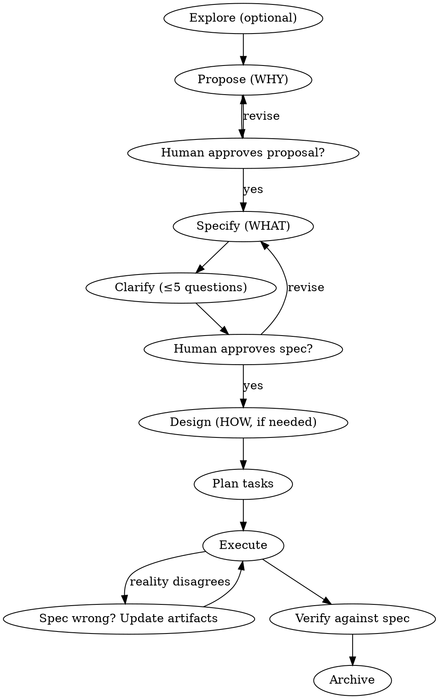

# Spec-Driven Workflow

## Overview

Structured work in any domain fails the same way: execution starts before intent is agreed, requirements live only in someone's head, and "done" has no definition. This skill inverts that. **The spec is the source of truth; execution serves the spec.**

Every change moves through a chain of small artifacts, each answering one question:

| Artifact | Question | Skip when |
|----------|----------|-----------|
| `proposal.md` | **WHY** are we doing this? | Never — always write it (can be 5 lines) |
| `spec.md` | **WHAT** must be true when we're done? | Never — always write it |
| `design.md` | **HOW** will we approach it? | Simple changes with one obvious approach |
| `tasks.md` | **In what order**, by whom, verified how? | Never — always write it |

Artifacts are **enablers, not phases**. Real work is not waterfall: you may execute a task, discover the spec was wrong, update the spec, and continue. Dependencies show what is *possible* next, not what is *mandatory* next. What never changes: artifacts stay in sync with reality, and the human gates below are respected.

**Announce at start:** "I'm using the spec-driven-workflow skill to structure this work."

## Two Modes

Pick the mode by the shape of the work, not its domain:

| | **Lite mode** (default for everyday work) | **Full mode** |
|---|---|---|
| Fits | A multi-day task owned by one person: prepare a report, run a hiring round, organize a move, quarterly filing | Cross-cutting changes: many stakeholders, competing approaches, changes to standing systems/processes |
| Artifacts | `brief.md` (WHY+WHAT on one page) + `tasks.md` + `log.md` | `proposal.md` + `spec.md` + `design.md`? + `tasks.md` + `log.md` |
| Gates | One: human approves the brief before execution | Two: proposal approval, then spec approval |
| Living specs | Usually none — archive the folder and keep learnings | Delta specs merged into living specs at archive |

Lite mode is the same discipline, compressed: done-criteria are still written as WHEN/THEN scenarios, guesses are still marked `[NEEDS CLARIFICATION]`, and execution still doesn't start before approval. If a "small task" turns out to have multiple stakeholders or contested scope mid-flight, upgrade it to full mode by splitting the brief into proposal + spec.

## Hard Gates

<HARD-GATE>
Do NOT begin execution (writing production code, sending communications, booking vendors, publishing content, making irreversible changes) until:
1. Full mode: a proposal AND a spec exist, each approved by your human partner. Lite mode: a brief exists and your human partner approved it.
2. Zero unresolved [NEEDS CLARIFICATION] markers remain in the approved artifact.
3. A tasks.md exists.
This applies to EVERY change regardless of perceived simplicity.
</HARD-GATE>

"This is too simple to need a spec" is the anti-pattern that causes the most wasted work. For truly simple changes the whole chain can be one page written in ten minutes — but it must exist and be approved.

## Directory Convention

All artifacts live in the workspace under `specs/`:

```
specs/
  principles.md                      # Optional: standing rules for all work (the "constitution")
  <capability>/spec.md               # Living specs: current agreed truth, per capability/area
  changes/
    <change-name>/                   # One folder per change, kebab-case (e.g. add-dark-mode, q3-tax-filing)
      brief.md                       # Lite mode: replaces proposal.md + spec.md
      proposal.md                    # Full mode
      spec.md                        # Full mode: deltas against living specs (or full spec if new)
      design.md                      # Full mode, only when needed
      tasks.md
      log.md                         # Work journal — required for anything spanning multiple sessions
    archive/
      YYYY-MM-DD-<change-name>/      # Completed changes move here
```

User preferences for location override this default. In repos that already use another convention (openspec/, specs/NNN-*/, docs/), follow the existing one.

## The Workflow



**Lite mode path:** Explore (optional) → write `brief.md` (steps 2+3 compressed into one page, using `templates/brief.md`) → Clarify (step 4 applies as-is) → human approves the brief → Plan tasks → Execute with log → Verify → Archive. Skip design.md unless a real approach decision appears.

### 0. Principles (once per project, optional)

If the project has recurring non-negotiables — quality bars, budget ceilings, brand voice, tech constraints, decision authority — capture them in `specs/principles.md`. Every later artifact must comply with it; when a proposal conflicts with a principle, surface the conflict instead of silently violating either.

### 1. Explore (optional)

A no-stakes thinking mode before anything is written. Read the current state (code, docs, prior changes, calendars, budgets), weigh options, help your human partner shape the idea. No artifacts, no commitment. When the idea crystallizes, transition to Propose.

### 2. Propose — WHY

Create `specs/changes/<change-name>/proposal.md` using `templates/proposal.md`. Keep it to 1–2 pages: the problem or opportunity, what changes at a headline level, which capabilities/areas are affected, impact and risks of doing it (and of not doing it).

**Gate:** present the proposal and get explicit approval before specifying.

### 3. Specify — WHAT

Create `spec.md` using `templates/spec.md`. Rules that make specs verifiable in any domain:

- **Requirements use SHALL/MUST**, one `### Requirement:` block each — no "should probably", no vague aspirations.
- **Every requirement has at least one scenario** in WHEN/THEN form. A scenario is a concrete, observable test: for software it becomes a test case; for an event, "WHEN a guest with a dietary restriction registered THEN their meal matches at check-in"; for a hiring process, "WHEN a candidate completes the final interview THEN they receive a decision within 5 business days."
- **Prioritize independently deliverable slices** (P1, P2, P3…). P1 alone must be a viable outcome. This is what lets you cut scope late without renegotiating everything.
- **Mark every guess** with `[NEEDS CLARIFICATION: question]` instead of inventing an answer.
- **Existing systems get deltas, not rewrites.** If a living spec exists for the capability, write the change as `## ADDED Requirements`, `## MODIFIED Requirements` (copy the full block, then edit), `## REMOVED Requirements` (with reason and migration). The living spec stays the source of truth until archive time.

### 4. Clarify

Scan the spec for `[NEEDS CLARIFICATION]` markers, ambiguity, contradictions, and unstated assumptions. Ask your human partner **up to 5 targeted questions, one at a time** — multiple choice where possible. Encode each answer back into the spec immediately, then remove the marker. Do not proceed to execution with unresolved markers.

Then self-review the spec: placeholder scan, internal consistency, scope check (does it need decomposition into multiple changes?), ambiguity check. Fix inline.

**Gate:** ask your human partner to review the written spec. Only proceed once approved.

### 5. Design — HOW (conditional)

Create `design.md` using `templates/design.md` **only when** the change is cross-cutting, introduces new dependencies/vendors/tools, carries security/budget/migration complexity, or has genuinely competing approaches. Before writing it, **propose 2–3 approaches with trade-offs and your recommendation** and let your human partner choose. Record decisions with rationale and alternatives considered, risks with mitigations, and open questions.

For simple changes, skip it and say so.

### 6. Plan tasks

Create `tasks.md` using `templates/tasks.md`:

- Every task is a checkbox: `- [ ] X.Y Description` — this is the progress tracker.
- Group by numbered section, **ordered by dependency**; group tasks under the priority slice (P1/P2/…) they deliver where applicable.
- Mark independent tasks `[P]` — they can run in parallel or be delegated.
- Each task names an **owner** (you, your human partner, a third party) when work is delegated — critical for non-dev work.
- Each task ends with something **verifiable**: a passing test, an artifact that exists, a confirmation received. "Work on X" is not a task.
- Write tasks for an executor with zero context: exact paths, exact commands, exact contacts, no "TBD" / "handle appropriately" / "similar to task N".
- **For multi-day work**, additionally:
  - Attach `(due: YYYY-MM-DD)` to anything deadline-bound, and put hard external deadlines at the top of the file where they can't be missed.
  - Size tasks to fit within one session (roughly ≤ half a day of effort). A task you can't finish in one sitting will be half-done forever; split it.
  - Sequence by dependency AND by calendar: tasks that trigger external waits (requests, approvals, orders) go as early as possible so the wait overlaps your other work.

### 7. Execute

Work through `tasks.md` in order, marking `- [x]` as you complete each. This is where "fluid, not waterfall" matters:

- When reality contradicts an artifact, **stop and update the artifact first** (spec, design, or tasks), then continue. Never let artifacts and reality diverge silently.
- If a change invalidates the approved scope (not just details), go back through the human gate.
- Pause and ask when blocked; don't improvise around a blocker that has spec implications.
- For software: prefer TDD per task; commit frequently; if the superpowers execution skills are available (`subagent-driven-development`, `executing-plans`), use them to run the task list.

#### Multi-day execution (sessions with zero memory)

Work that spans days is executed as a series of sessions, and **the artifacts are the only memory**. Assume the next session — tomorrow's you, another agent, or your human partner — remembers nothing.

**Session start — reorient before acting:**
1. Find active changes: folders under `specs/changes/` (excluding `archive/`) whose `tasks.md` has unchecked boxes.
2. Read `brief.md` (or `proposal.md`+`spec.md`), `tasks.md`, and the last entries of `log.md`.
3. Check the **Waiting On** table in `log.md`: has anything arrived? Is any follow-up date due today or past? Follow up on overdue items first — they gate other work.
4. Summarize state to your human partner before doing anything: "X of Y tasks done. Last session: [...]. Waiting on: [...]. Today I plan to: [...]. Anything changed on your side?" — the last question matters; days passing means reality may have moved.

**Session end — leave the campsite readable (never skip, even mid-task):**
1. Update `tasks.md` checkboxes to match reality. A half-finished task stays unchecked — note exactly where it stands in the log instead.
2. Append a dated entry to `log.md`: what was done, decisions made (with why), what changed in the artifacts, and **the single next action**, concrete enough to start cold ("draft section 3 using the numbers in `research/costs.md`", not "continue the report").
3. Update the Waiting On table: new waits get a description, who owes it, and a follow-up date. Resolved waits get closed out.

**Waiting on external parties:** when a task is sent out for response or approval, mark it `⏳` in `tasks.md`, log it in Waiting On with a follow-up date, and move on to the next unblocked task — a wait is not a stopping point for the whole change. If everything is blocked, say so explicitly and schedule the follow-ups rather than idling.

**Re-planning:** plans decay across days. If priorities shifted, a deadline moved, or a wait came back with a surprise, revise `tasks.md` (and the brief/spec if scope changed) at session start — through the human gate if scope is affected — before executing.

### 8. Verify

Before claiming completion, verify **against the spec, not against the task list**:

1. Walk every requirement's scenarios: demonstrate each WHEN/THEN actually holds, with fresh evidence (run the test, check the booking, open the published page). No evidence, no completion claim.
2. Cross-artifact consistency: does what was built/done match proposal scope? Any task silently skipped? Any requirement with no corresponding completed work?
3. Report gaps honestly. A verified 80% with a named remainder beats a claimed 100%.

### 9. Archive

When the change is complete and verified:

1. **Merge delta specs into the living specs** (`specs/<capability>/spec.md`): apply ADDED/MODIFIED/REMOVED so living specs reflect the new current truth.
2. Move the change folder to `specs/changes/archive/YYYY-MM-DD-<change-name>/`.
3. Record learnings that should outlive the change — new constraints go to `principles.md`, process fixes go into how you write the next spec.

The living specs are the durable asset. A year later, nobody reads the archived tasks; everyone reads the current spec.

## Domain Mapping

The chain is domain-agnostic. Translate the nouns:

| Artifact | Software | Project mgmt / Ops | Content / Marketing |
|----------|----------|--------------------|---------------------|
| Principles | Architecture rules, tech stack | Budget authority, compliance, quality bar | Brand voice, style guide |
| Proposal | Feature proposal | Project charter | Campaign brief |
| Spec | Requirements + acceptance scenarios | Deliverables + done-criteria per stakeholder | Audience, message, success metrics |
| Design | Technical design | Approach, resourcing, vendor choice | Creative direction, channel plan |
| Tasks | Implementation checklist | Work breakdown with owners & dates | Production & publication checklist |
| Verify | Tests pass, scenarios demoed | Acceptance review with stakeholders | Metrics vs. success criteria |
| Living spec | System behavior spec | Standing process docs / runbooks | Evergreen brand & channel specs |

## Red Flags — Stop and Course-Correct

| You're thinking… | Reality |
|---|---|
| "This is too simple to need a spec" | Simple work with unexamined assumptions is where rework concentrates. Write the one-page version. |
| "I'll fill in [NEEDS CLARIFICATION] myself, it's obvious" | If it were obvious you wouldn't have marked it. Ask. |
| "I'll just start and spec it retroactively" | A retroactive spec is a description, not an agreement. The gate exists to catch misalignment *before* cost is sunk. |
| "The spec is a bit stale but I know what I'm doing" | Divergence compounds. Update the artifact now — it's 2 minutes. |
| "All tasks are checked, so we're done" | Done is defined by the spec's scenarios, not the task list. Verify with evidence. |
| "I'll batch all my clarifying questions at the end" | Answers change the questions that follow. One at a time, early. |
| "I'll remember where I left off" | Sessions have zero memory. If it's not in `log.md` and `tasks.md`, it didn't happen. Write the session-end entry now. |
| "We're waiting on X, so nothing can move" | One wait rarely blocks everything. Mark it `⏳` with a follow-up date and pull the next unblocked task. |
| "It's a small everyday task, the workflow doesn't apply" | That's what lite mode is for: a one-page brief and a task list still beat improvising across three days. |

## Templates

Load only when writing the corresponding artifact:

- `templates/brief.md` — WHY+WHAT on one page (lite mode)
- `templates/proposal.md` — WHY (full mode)
- `templates/spec.md` — WHAT including delta format (full mode)
- `templates/design.md` — HOW
- `templates/tasks.md` — execution checklist
- `templates/log.md` — work journal + Waiting On table (multi-session work)
